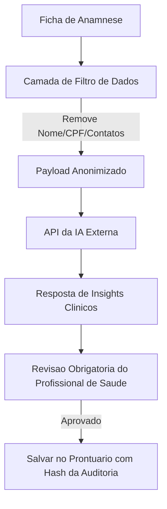

# Guia de Evolução: PWA Offline, Modo Cabine/Tablet e Integração de IA Segura

Este documento define as diretrizes arquiteturais e técnicas para a evolução dos recursos de PWA offline, otimização de telas para tablets (Modo Cabine) e a introdução de modelos de Inteligência Artificial em conformidade com a LGPD e a segurança clínica.

---

## 📱 1. PWA & Sincronização Offline Avançada

O sistema atualmente utiliza um Service Worker para caching estático e o módulo `offlineSync.ts` baseado em **IndexedDB** para capturar e enfileirar requisições mutativas (`POST`, `PUT`, `PATCH`) quando o profissional está offline.

### Próximos Passos para Evolução Offline:
1. **Cache de Leitura Automático (Read Cache):**
   * Armazenar a agenda de atendimentos do dia corrente e a ficha cadastral básica dos pacientes agendados no banco IndexedDB no primeiro carregamento do dia.
   * Caso o profissional perca a conexão na clínica, ele ainda poderá consultar o prontuário e o histórico sem que a página exiba erros de carregamento.
2. **Resolução de Conflitos na Sincronização:**
   * Caso um prontuário seja editado offline em um dispositivo e online em outro, o backend deve adotar uma estratégia de resolução de conflitos (ex: baseada no timestamp da alteração ou mesclando campos vazios).

---

## 🩺 2. Modo Cabine / Tablet UX

O **Modo Cabine** é um modo de visualização focado na interação com o paciente durante a consulta ou na recepção da clínica para assinatura digital de termos.

### Diretrizes de Implementação:
1. **Interface Focada em Touch:**
   * Aumentar áreas clicáveis (botões de pelo menos `48px` de altura).
   * Minimizar o uso de digitação excessiva, preferindo campos de seleção rápida (checkboxes, switchers e botões radiais).
2. **Sandbox de Segurança do Paciente:**
   * Ao disponibilizar o tablet para o paciente ler e assinar um termo de consentimento, a aplicação deve entrar em um modo restrito ("modo quiosque").
   * Este modo oculta menus laterais, dados financeiros da clínica e dados de outros pacientes, prevenindo o vazamento acidental de informações protegidas (vazamento de dados por terceiros).
3. **Assinatura Digital Otimizada:**
   * Utilizar componentes do tipo `SignaturePad` otimizados para canetas stylus ou toques de dedo, com renderização de canvas de alta sensibilidade e salvamento de coordenadas vetoriais para fins legais.

---

## 🤖 3. Inteligência Artificial em Conformidade com a LGPD

A integração de IA (ex: OpenAI, Google Gemini) tem como objetivo gerar resumos clínicos e identificar riscos automaticamente a partir das fichas de anamnese. No entanto, por lidar com **dados de saúde (dados pessoais sensíveis)**, deve seguir regras estritas:

### Fluxo de Anonimização Obrigatório:
Antes de enviar qualquer payload para APIs de IA externas, o backend deve filtrar e mascarar os dados pessoais:
* **Identificadores Diretos:** Remover nomes, CPFs, e-mails, telefones e substituí-los por hashes genéricos (ex: `Paciente_A_9281`).
* **Identificadores Indiretos:** Mascarar datas exatas de nascimento (usando apenas a idade em anos) e detalhes que revelem o endereço específico.

### Arquitetura de Integração Segura:

### Regras de Ouro para IA:
1. **Consentimento Explícito:** A clínica deve aceitar expressamente os termos de ativação da IA e o paciente deve autorizar o processamento assistido em sua ficha de consentimento de dados.
2. **Revisão Humana Obrigatória:** A IA nunca deve tomar decisões ou prescrever protocolos de forma autônoma. O resultado gerado é tratado como rascunho de auxílio e só se torna definitivo após a assinatura e revisão manual do profissional de saúde.
3. **Auditoria de Decisões:** Cada insight sugerido pela IA e incorporado ao prontuário deve registrar no log de auditoria: a versão do modelo utilizado, o payload de entrada anonimizado e o e-mail do profissional que validou e salvou o registro.
